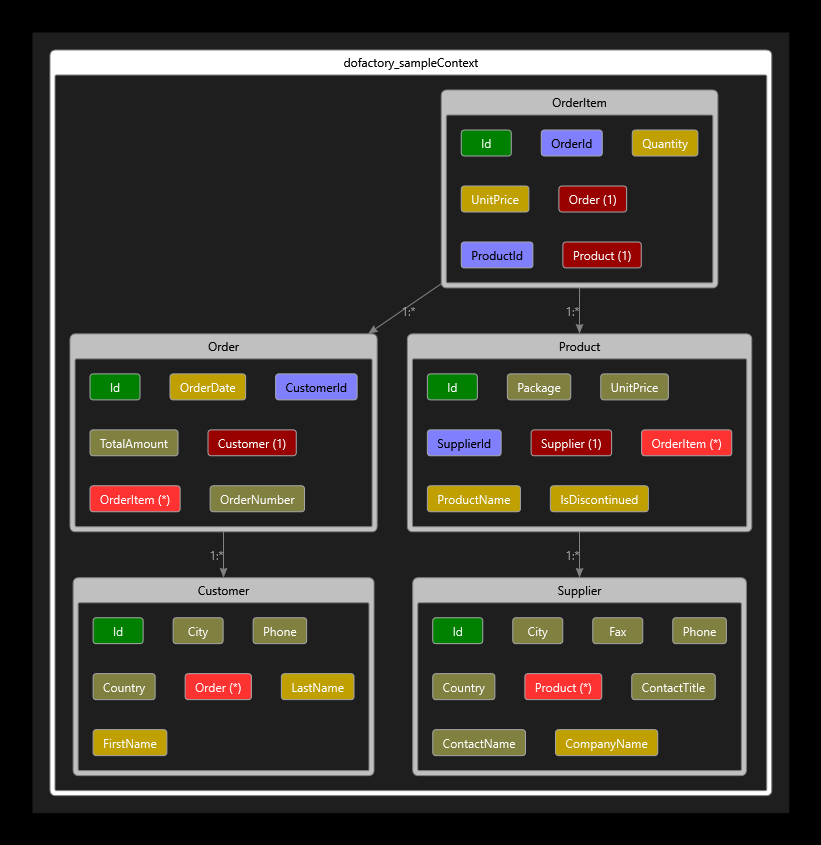

# DoFactory-Sample

Starting from [SQL Tutorial Sample Database](https://www.dofactory.com/sql/sample-database) at dofactory.com

My plan (as of this writing) is to create a kind of grid-dropdown using [react-autocomplete](https://github.com/reactjs/react-autocomplete).

## Initial Run

I'm using VS Studio 2019, though this will almost certainly work in previous versions as well.

1. Create and populate the database:
   1. Open the SQL Server Object Explorer
   2. See that you're connected to `(localdb)\MSSQLLocalDB`
   3. Create a new database `dofactory_sample`
   4. Edit the file `Db_Scripts\dofactory-sample-database\sample-model.sql`
   5. Connect the editor to the database you just created
   6. Run the script (and check that it worked, of course)
   7. Do the same steps for `...sample-data.sql`
2. Launch - If website appears without any error messages, the initial run was a success
3. In the default "Most Recent 20..." view, use Create New to bring up the form for creating a new Order Item.  To the right of the "HelloWorld AutoComplete" label, there should be a working (though dumb) autocomplete field with some items to select from. 

## Other Tooling

Extension [ErikEJ/EFCorePowerTools](https://github.com/ErikEJ/EFCorePowerTools/wiki)

At the time of this edit (4/28/2019, ~1730 EDT), the EF-Core-Power-Tools that one presently gets from VS Marketplace, version 2.2.12, does not work with VS 2019, at least not for generating the diagram.  Instead use version 2.2.59 (or above I assume) from [Open VSIX gallery](http://vsixgallery.com/extension/f4c4712c-ceae-4803-8e52-0e2049d5de9f/); the [VSIX Gallery - nightly builds](https://github.com/madskristensen/VsixGalleryExtension) is itself available as an extention. Then grab DGML Editor from the VS installer.  This was more effort than I expected.

## Entities

Once you have the EFCorePowerTools and DGML Editor described above, you can update this diagram as needed:

